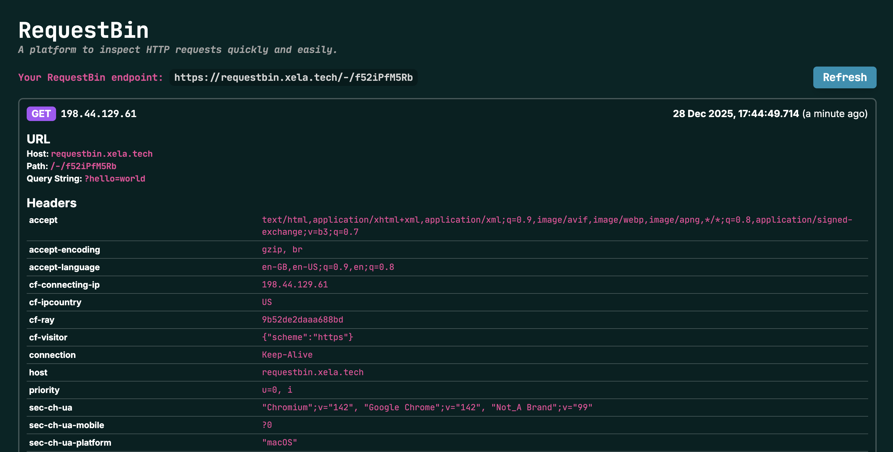

# RequestBin

> A platform to inspect HTTP requests quickly and easily.

### [bin.xela.tech](https://bin.xela.tech)

## Preview

## Usage

This project is designed for deployment as a Cloudflare Workers project.

It uses Cloudflare D1 as the underlying data store, with a React frontend for displaying request information.

The information displayed could be encriched in a number of ways. If the UI doesn't provide information that you feel would be useful to analyse requests more effectively, please open an issue.

## LICENSE

MIT

